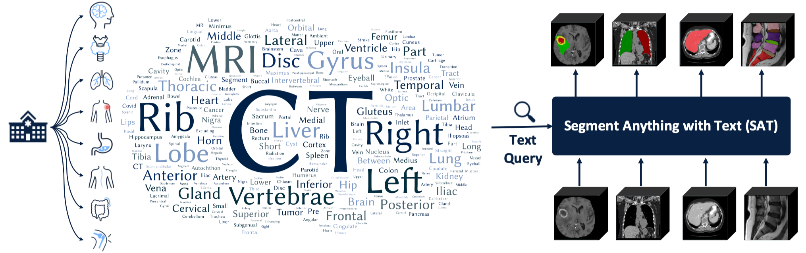

# SAT
This is the official repository for "One Model to Rule them All: Towards Universal Segmentation for Medical Images with Text Prompts"



[ArXiv](https://arxiv.org/abs/2312.17183)

[Website](https://zhaoziheng.github.io/SAT/)

## Latest News:
The inference code and model checkpoint of SAT-Nano have been released. The SAT-Ultra is coming soon.

## Inference Guidance:
- S1. Build the environment following the requirements.
- S2. Download checkpoint of SAT and Text Encodewr from [baiduyun](https://pan.baidu.com/s/1zvR3icGTfThT_sWS6iwykA?pwd=jgwh) or [google drive](https://drive.google.com/drive/folders/1VJFXGf-bdYuDwKI5xDKtlEi-uQT3GTO3?usp=share_link).
- S3. Prepare the data to inference in a jsonl file. A demo can be found in `data/inference_demo/demo.jsonl`. Make sure the image path, label name and modality are correctly filled in. For the label name and modality, please refer to Table 8 of the [paper](https://arxiv.org/abs/2312.17183) for reference. Download links of the dataset involved in training SAT-Nano can be found below.
- S4. Start the inference with the following command:
    ```
    torchrun \
    --nproc_per_node=1 \
    --master_port 1234 \
    inference.py \
    --data_jsonl 'data/inference_demo/demo.jsonl' \
    --checkpoint 'path to SAT-Nano checkpoint' \
    --text_encoder_checkpoint 'path to Text encoder checkpoint' \
    ```
    Note that you may modify `--max_queries` and `--batchsize` to accelerate the inference, based on the computation resource you have.
- S5. Check the path where you store the images. For each image, a folder with the same name will be created. Inside each folder, you will find the predictions for each label (named after the label), the aggregate results for all labels (prediction.nii.gz), and the input image (image.nii.gz). You can visualize them using the [ITK-SNAP](http://www.itksnap.org/pmwiki/pmwiki.php).

## Requirements
The implementation of U-Net relies on a customized version of [dynamic-network-architectures](https://github.com/MIC-DKFZ/dynamic-network-architectures), to install it:
```
cd model
pip install -e dynamic-network-architectures-main
```

Some other key requirements:
```
torch>=1.10.0
numpy==1.21.5
monai==1.1.0 
transformers==4.21.3
nibabel==4.0.2
einops==0.6.1
positional_encodings==6.0.1
```

## Datasets
| Dataset | Download Link |
|---|---|
| AbdomenCT1K | https://github.com/JunMa11/AbdomenCT-1K |
| ACDC | https://humanheart-project.creatis.insa-lyon.fr/database/ |
| Brain Atlas | http://brain-development.org/ |
| BrainPTM | https://brainptm-2021.grand-challenge.org/ |
| BraTS2021 | http://braintumorsegmentation.org/ |
| CHAOS | https://chaos.grand-challenge.org/ |
| CHAOS MR | https://chaos.grand-challenge.org/ |
| Couinaud | https://github.com/GLCUnet/dataset |
| COVID-19 CT Seg | https://github.com/JunMa11/COVID-19-CT-Seg-Benchmark |
| FLARE22 | https://flare22.grand-challenge.org/ |
| HAN Seg | https://zenodo.org/record/ |
| ISLES2022 | http://www.isles-challenge.org/ |
| KITS21 | https://kits-challenge.org/kits21/ |
| LUNA16 | https://luna16.grand-challenge.org/ |
| MRSpineSeg | https://www.cg.informatik.uni-siegen.de/en/spine-segmentation-and-analysis |
| MSD Cardiac | http://medicaldecathlon.com/ |
| MSD Colon | http://medicaldecathlon.com/ |
| MSD HepaticVessel | http://medicaldecathlon.com/ |
| MSD Hippocampus | http://medicaldecathlon.com/ |
| MSD Liver | http://medicaldecathlon.com/ |
| MSD Lung | http://medicaldecathlon.com/ |
| MSD Pancreas | http://medicaldecathlon.com/ |
| MSD Prostate | http://medicaldecathlon.com/ |
| MSD Spleen | http://medicaldecathlon.com/ |
| NSCLC | https://wiki.cancerimagingarchive.net/pages/viewpage.action?pageId=68551327 |
| PROMISE12 | https://promise12.grand-challenge.org/Details/ |
| SKI10 | https://ambellan.de/sharing/QjrntLwah |
| SLIVER07 | https://sliver07.grand-challenge.org/ |
| TotalSegmentator | https://zenodo.org/record/6802614 |
| WMH | https://wmh.isi.uu.nl/ |
| WORD | https://github.com/HiLab-git/WORD |

## TODO
- [x] Release the inference code of SAT-Nano
- [x] Release the model of SAT-Nano
- [ ] Release SAT-Ultra

# Citation
If you use this code for your research or project, please cite:
```
@arxiv{zhao2023model,
  title={One Model to Rule them All: Towards Universal Segmentation for Medical Images with Text Prompt}, 
  author={Ziheng Zhao and Yao Zhang and Chaoyi Wu and Xiaoman Zhang and Ya Zhang and Yanfeng Wang and Weidi Xie},
  year={2023},
  journal={arXiv preprint arXiv:2312.17183},
}
```
