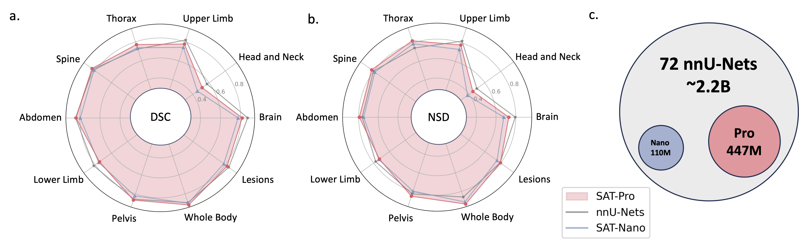

# SAT
[](https://arxiv.org/abs/2312.17183)
[](https://github.com/zhaoziheng/SAT)
[](https://www.dropbox.com/scl/fo/922fefjab8fp9j5czrqxo/AGU0eCBC-SLrO8BnsIzrQIg?rlkey=gddj22sfcpu5rr9vlzj3a2jmq&st=uzim2ow3&dl=0)
[](https://github.com/zhaoziheng/SAT-DS)

This is the official repository for "One Model to Rule them All: Towards Universal Segmentation for Medical Images with Text Prompts" 🚀 

It's a knowledge-enhanced universal segmentation model built upon an unprecedented data collection (72 public 3D medical segmentation datasets), which can segment 497 classes from 3 different modalities (MR, CT, PET) and 8 human body regions, prompted by text (anatomical terminology).


It can be powerful and more efficient than training and deploying a series of specialist models. Find more on our [paper](https://arxiv.org/abs/2312.17183).



## Latest News:
- 2025.03 📢 SAT is one of the baseline method for [CVPR 2025: FOUNDATION MODELS FOR TEXT-GUIDED 3D BIOMEDICAL IMAGE SEGMENTATION](https://www.codabench.org/competitions/5651/). Check our latest [branch](https://github.com/zhaoziheng/SAT/tree/cvpr2025challenge).
- 2025.03 📢 We released the code adn knowledge data for knowledge pre-training in SAT. Check this [repo](https://github.com/zhaoziheng/SAT-Pretrain/tree/master).

## Requirements
The implementation of U-Net relies on a customized version of [dynamic-network-architectures](https://github.com/MIC-DKFZ/dynamic-network-architectures), to install it:
```
cd model
pip install -e dynamic-network-architectures-main
```

Some other key requirements:
```
torch>=1.10.0
numpy==1.21.5
monai==1.1.0 
transformers==4.21.3
nibabel==4.0.2
einops==0.6.1
positional_encodings==6.0.1
```

You also need to install `mamba_ssm` if you want the U-Mamba variant of SAT-Nano

## Inference Guidance (Command Line):
- S1. Build the environment following `requirements.txt`.

- S2. Download checkpoint of SAT and Text Encoder from [huggingface](https://huggingface.co/zzh99/SAT).
  
- S3. Prepare the data in a jsonl file. Check the demo in `data/inference_demo/demo.jsonl`.
    1. `image`(path to image), `label`(name of segmentation targets in a list), `dataset`(which dataset the sample belongs to) and `modality`(ct, mri or pet) are needed for each sample to segment. Modalities and classes that SAT supports can be found in in Table 12 of the paper.

    2. `orientation_code`(orientation) is `RAS` by default, which suits most images in axial plane. For images in sagittal plane (for instance, spine examination), set this to `ASR`.
The input image should be with shape `H,W,D` Our data process code will normalize the input image in terms of orientation, intensity, spacing and so on. Two successfully processed images can be found in `demo\processed_data`, make sure the normalization is done correctly to guarantee the performance of SAT.

- S4. Start the inference with SAT-Pro 🕶:
    ```
    torchrun \
    --nproc_per_node=1 \
    --master_port 1234 \
    inference.py \
    --rcd_dir 'demo/inference_demo/results' \
    --datasets_jsonl 'demo/inference_demo/demo.jsonl' \
    --vision_backbone 'UNET-L' \
    --checkpoint 'path to SAT-Pro checkpoint' \    
    --text_encoder 'ours' \
    --text_encoder_checkpoint 'path to Text encoder checkpoint' \
    --max_queries 256 \
    --batchsize_3d 2
    ```
    ⚠️ NOTE: `--batchsize_3d` is the batch size of input image patches, and need to be adjusted based on the gpu memory (check the table below);
    `--max_queries` is recommended to set larger than the classes in the inference dataset, unless your gpu memory is very limited;
    | Model | batchsize_3d | GPU Memory |
    |---|---|---|
    | SAT-Pro | 1 | ~ 34GB |
    | SAT-Pro | 2 | ~ 62GB |
    | SAT-Nano | 1 | ~ 24GB |
    | SAT-Nano | 2 | ~ 36GB |

- S5. Check `--rcd_dir` for outputs. Results are organized by datasets. For each case, the input image, aggregated segmentation result and a folder containing segmentations of each class will be found. All outputs are stored as nifiti files. You can visualize them using the [ITK-SNAP](http://www.itksnap.org/pmwiki/pmwiki.php).
  
- If you want to use SAT-Nano trained on 72 datasets, just modify `--vision_backbone` to 'UNET', and change the `--checkpoint` and `--text_encoder_checkpoint` accordingly.
  
- For other SAT-Nano variants (trained on 49 datasets):
  
  UNET-Ours: set `--vision_backbone 'UNET'` and `--text_encoder 'ours'`;

  UNET-CPT: set `--vision_backbone 'UNET'` and `--text_encoder 'medcpt'`;

  UNET-BB: set `--vision_backbone 'UNET'` and `--text_encoder 'basebert'`;

  UMamba-CPT: set `--vision_backbone 'UMamba'` and `--text_encoder 'medcpt'`;

  SwinUNETR-CPT: set `--vision_backbone 'SwinUNETR'` and `--text_encoder 'medcpt'`;

## Train Guidance:
Some preparation before start the training:
  1. You need to build your training data following this [repo](https://github.com/zhaoziheng/SAT-DS/tree/main), specifically, from step 1 to step 5. A jsonl containing all the training samples is required.
  2. You need to fetch the pre-trained text encoder checkpoint from https://huggingface.co/zzh99/SAT to generate prompts. If you want to re-do the knowledge enhancement pre-training from scratch, you may refer to this [repo](https://github.com/zhaoziheng/SAT-Pretrain/tree/master).

Our recommendation for training SAT-Nano is 8 or more A100-80G, for SAT-Pro is 16 or more A100-80G. You can of course modify the `crop_size` or other hyperparameters to reduce computational consumption and requirement. Use the slurm script in `sh/` for a reference to start the training process. Take SAT-Pro for example:
  ```
  sbatch sh/train_sat_pro.sh
  ```

## Evaluation Guidance:
This also requires to build test data following this [repo](https://github.com/zhaoziheng/SAT-DS/tree/main). 
You may refer to the slurm script `sh/evaluate_sat_pro.sh` to start the evaluation process:
  ```
  sbatch sh/evaluate_sat_pro.sh
  ```

## Baselines
We provide the detailed configurations of all the specialist models (nnU-Nets, U-Mambas, SwinUNETR) we have trained and evaluated [here](https://github.com/zhaoziheng/SAT-DS/blob/main/data/specialist_model_config).

## Citation
If you use this code for your research or project, please cite:
```
@arxiv{zhao2023model,
  title={One Model to Rule them All: Towards Universal Segmentation for Medical Images with Text Prompt}, 
  author={Ziheng Zhao and Yao Zhang and Chaoyi Wu and Xiaoman Zhang and Ya Zhang and Yanfeng Wang and Weidi Xie},
  year={2023},
  journal={arXiv preprint arXiv:2312.17183},
}
```
